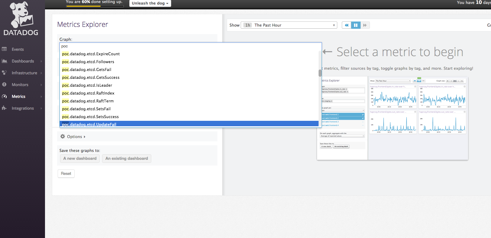

# p-datadog-firehose-nozzle
Datadog firehose nozzle ops manager tile

## References

* [Datadog firehose nozzle bosh release](https://github.com/cloudfoundry-incubator/datadog-firehose-nozzle-release)

* [OpsMgr interface](http://docs.pivotal.io/pivotalcf/customizing/pcf-interface.html)

## Prerequisites

* Install Ops manager
* Install Elastic Runtime tile
* Create a datadog uaa client with [uaac](https://docs.cloudfoundry.org/adminguide/uaa-user-management.html)
* [Setup a datadog account](https://www.datadoghq.com/)


  ```
  uaac client add datadog-firehose-nozzle \
       --scope openid,oauth.approvals,doppler.firehose \
       --authorities oauth.login,doppler.firehose \
       --authorized_grant_types authorization_code,client_credentials,refresh_token \
       --access_token_validity 1209600 \
       --secret [secret]
  ```

## Configure the tile

* Configure the API URL and APT Key of datadog
* Configure the uaa client for datadog firehose nozzle
* Apply changes and validate the metrics sent to datadog

  

  
